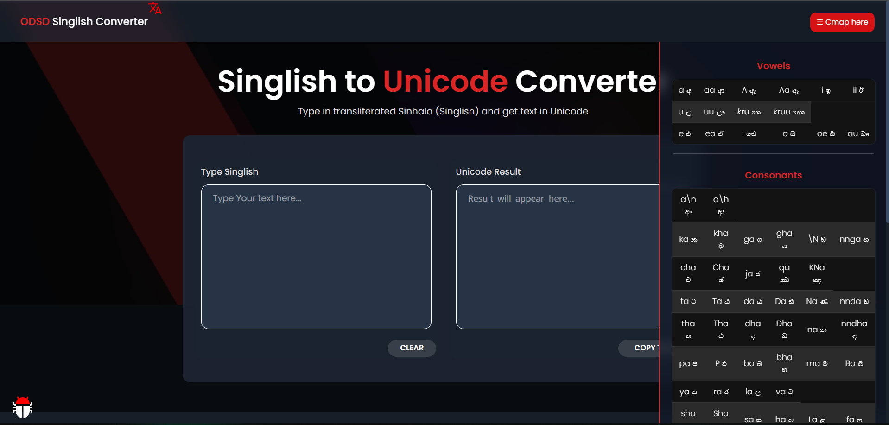
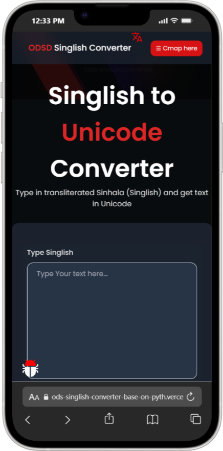
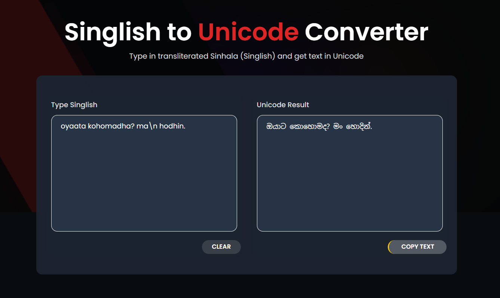

# ODS Singlish Converter
*A powerful tool that converts Singlish (Latin‑script Sinhala) into Sinhala Unicode script*  
© 2025 Daham Sathmin.

[](https://www.gnu.org/licenses/gpl-3.0.html)
[](https://www.python.org/downloads/)

---

## 💡 What it does
ODS Singlish Converter converts Singlish (Latin-script Sinhala) into Sinhala Unicode text.  
Example: `kohomadha` → `කොහොමද`.

This project supports a web UI (Flask), and can be extended into CLI, desktop, or a Chrome extension.

---

## ✅ Key Features
- Real-time Singlish → Sinhala conversion
- Web UI built with Python & Flask
- Lightweight and easy to extend
- Ready for packaging into a desktop app (PyInstaller) or browser extension

---

##  preview



---

## 🧰 Tech Stack
- **Backend & conversion logic:** Python  
- **Web framework:** Flask  
- **Frontend:** HTML, CSS, JavaScript  
- **Optional packaging:** PyInstaller for desktop builds

---

## 🚀 Getting Started
### Prerequisites
- Python 3.x  
- Recommended: virtual environment

### Installation
```bash
git clone https://github.com/DahamSathmina/ODS_Singlish_Converter-Base_on_python.git
cd ODS_Singlish_Converter-Base_on_python
python -m venv venv
# Activate the virtual environment:
# Linux / macOS
source venv/bin/activate
# Windows (PowerShell)
venv\Scripts\Activate.ps1
# Or Windows (cmd)
venv\Scripts\activate

pip install -r requirements.txt
```

### Usage — Web Version
```bash
python app.py
```
Open `http://localhost:5000` in your browser, paste Singlish input, click **Convert**, and view the Sinhala output.


---

## 📁 Project Structure
```
├── app.py                  # Flask web application
├── converter.py            # Core Singlish -> Sinhala logic
├── requirements.txt        # Python dependencies
├── Demo/                 # Screenshots and visuals
│   ├── web-ui.png
│   └── converted-text.png
├── static/                 # Front-end assets (css/js)
├── templates/              # HTML templates for the web UI
└── LICENSE                 # GPL-3.0 License
```

---

## 🤝 Contributing
Contributions are welcome! Ways to help:
- Open issues for bugs or feature requests
- Fork the repo and submit a pull request
- Improve conversion accuracy and add tests
- Add platform support (desktop packaging, mobile port)
- Improve UI/UX and localization

When contributing, please follow these steps:
1. Fork the repository
2. Create a feature branch (`git checkout -b feature-name`)
3. Make changes and add tests where applicable
4. Open a pull request describing your changes

---

## 📄 License
This project is licensed under the [GNU General Public License v3.0](https://www.gnu.org/licenses/gpl-3.0.html).

---

## 📞 Contact
- Author: Daham Sathmin  
- GitHub: https://github.com/DahamSathmina  
- For support or collaboration, create an issue in the repository.

---

**Thank you for using ODS Singlish Converter!** 🌟
